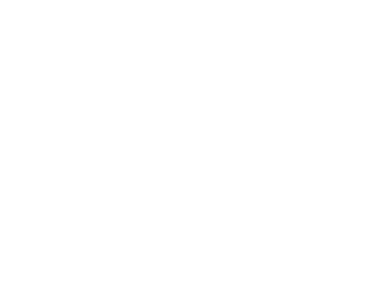

# GreenOvercast



GreenOvercast is a native Xbox Cloud Gaming and GeForce NOW client for small
ARM64 Linux handhelds, with hardware video decoding on supported H700 and
Rockchip firmware.

This independent project is not affiliated with Microsoft or NVIDIA.

You need internet access and an account for your chosen service:

- Xbox: an [Xbox Game Pass plan](https://www.xbox.com/cloud-gaming) that includes cloud gaming.
- [GeForce NOW](https://www.nvidia.com/en-us/geforce-now/): a membership and access to the games you want to play.

## Install

Copy `greenovercast.zip` to PortMaster's autoinstall folder, then open
PortMaster to install it. The folder location for each firmware is listed in
the [PortMaster FAQ](https://portmaster.games/faq.html#do-i-have-to-use-portmaster-to-install-ports).

When the installation finishes, return to the device frontend and launch
GreenOvercast from Ports.

Choose Xbox or GeForce NOW, then open the sign-in link shown on screen on
another device and enter the code. Your login is saved. You can switch services
from Settings without closing the app.

GreenOvercast is experimental.

## Controls

| Button             | Library / menus                   | In game                           |
| ------------------ | --------------------------------- | --------------------------------- |
| D-pad / Left Stick | Navigate; hold to scroll faster   | Movement                          |
| A                  | Select, play, or type              | Xbox A                            |
| B                  | Back or cancel                    | Xbox B                            |
| X                  | Search or delete a letter         | Xbox X                            |
| Y                  | Favorite a game or clear search   | Xbox Y                            |
| L1 / R1            | Switch All / Favorites            | Xbox LB / RB                      |
| L2 / R2            | Jump by first letter              | Xbox LT / RT                      |
| Start              | Settings or apply search          | Xbox Menu                         |
| Select             | —                                 | Xbox View                         |
| L3 + R3            | —                                 | Xbox Guide                        |
| Select + Start     | Exit after holding for one second | Exit after holding for one second |

Settings include Xbox/Nintendo face-button layouts, game artwork, and Sign
out. Games that return a 16:9 stream remain letterboxed on 4:3 displays.

GeForce NOW uses the same gamepad controls. For store dialogs and game
launchers, press Select + Y to toggle mouse mode: D-pad or left stick moves the
pointer, A clicks, B right-clicks, and L1 / R1 scroll. Store sign-in may still be
required inside the stream.

## Supported devices

| Device     | SoC             | OS                            | Status |
| ---------- | --------------- | ----------------------------- | ------ |
| RG35XX-H   | Allwinner H700  | muOS 2508.4                   | Tested |
| RG40XX-H   | Allwinner H700  | Knulli (Batocera 42)          | Tested |
| RG40XX-H   | Allwinner H700  | ROCKNIX 20260801              | Tested |
| Miyoo Flip | Rockchip RK3566 | SpruceOS 4.3.3                | Tested |
| R36S       | Rockchip RK3326 | AmberELEC prerelease-20250515 | Tested |

Hardware decoding is verified on the configurations above. H700 uses CedarX on
muOS and Knulli, and Cedrus on ROCKNIX. RK3566 and RK3326 use Rockchip MPP. Other
devices fall back to software decoding, which is too slow for normal gameplay.

GeForce NOW playback has been tested on muOS, Knulli, SpruceOS, and the R36S
running dArkOS 02012026. R36S frame pacing still needs work. The ROCKNIX and
AmberELEC rows above currently cover Xbox playback.

The release requires glibc 2.38 or newer. ArkOS ships glibc 2.30 and is not
supported.

## Build

You need a Linux or macOS host with `cmake`, `curl`, `git`, `make`, `patch`,
`perl`, and `python3`.

Host tests also need SDL2 development files and `pkg-config`: install
`libsdl2-dev pkg-config` on Debian/Ubuntu or `sdl2 pkg-config` with Homebrew.

```sh
tools/bootstrap.sh
tools/zig.sh build
tools/zig.sh build test
tools/zig.sh build fmt-check
```

Build the PortMaster package with:

```sh
PORTMASTER_NEW=/path/to/PortMaster-New tools/zig.sh build package
```

PortMaster-New is large. [JeodC's sparse-checkout guide](https://gist.github.com/JeodC/7a51211ad94ad6084d14042d80a62549)
shows how to fetch only the files needed for packaging.

The package build runs the current PortMaster checks and archive builder. To
queue the finished archive for PortMaster's supported autoinstall flow:

```sh
tools/deploy.sh <ssh-host> zig-out/greenovercast.zip
```

Launch PortMaster from the device frontend to install it. Then launch
GreenOvercast from Ports so the frontend owns the display handoff.

## License

MPL-2.0. See [LICENSE](LICENSE). The Cedar H.264 decoder is LGPLv2.1 and
dynamically linked. Third-party licenses are listed in [THIRDPARTY.md](THIRDPARTY.md).
